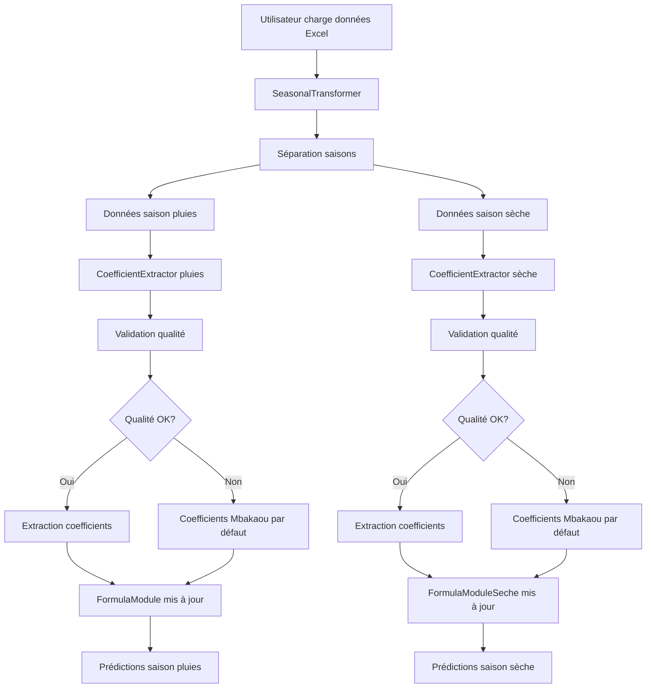

# Design Document: Dynamic Formula Coefficients Extraction

## Overview

Cette fonctionnalité transforme le système de prédiction hydrologique par formules d'un système spécifique à Mbakaou en un système universel adaptable à n'importe quelle zone géographique. L'architecture repose sur l'extraction automatique des coefficients (polynôme P(t), coefficients mensuels Cm, débit historique Q_HISTORICAL, et coefficients annuels k(A)) à partir des données historiques chargées par l'utilisateur.

### Objectifs Principaux

1. **Universalité**: Permettre l'utilisation du système pour n'importe quelle zone géographique
2. **Automatisation**: Extraire les coefficients sans intervention manuelle
3. **Rétrocompatibilité**: Maintenir les coefficients Mbakaou par défaut
4. **Non-perturbation**: Modifications ciblées uniquement dans les modules de formules
5. **Fraîcheur des données**: Supprimer le cache pour garantir l'utilisation des coefficients les plus récents

### Contraintes de Conception

- **Scope limité**: Modifications uniquement dans `backend/formula/`
- **Durées fixes**: 153 jours (pluies), 212 jours (sèche) - universelles
- **Mois fixes**: 5 mois (pluies: juillet-novembre), 7 mois (sèche: décembre-juin)
- **Méthodologie préservée**: Polynôme ordre 6, formule Q(t,A) = P(t) × k(A) × Cm × [1 ± ε(t)]
- **Pas de nouvelles routes**: Aucune modification de l'API ou des routes existantes

## Architecture

### Vue d'Ensemble du Flux de Données



### Architecture en Couches

```
┌─────────────────────────────────────────────────────────────┐
│                    Interface Utilisateur                     │
│              (Affichage coefficients extraits)               │
└─────────────────────────────────────────────────────────────┘
                              │
┌─────────────────────────────────────────────────────────────┐
│                   Couche Orchestration                       │
│              ApplicationController (inchangé)                │
└─────────────────────────────────────────────────────────────┘
                              │
┌─────────────────────────────────────────────────────────────┐
│                  Couche Extraction (NOUVEAU)                 │
│  ┌──────────────────────┐  ┌──────────────────────────┐    │
│  │ CoefficientExtractor │  │ DataQualityValidator     │    │
│  │  - extract_poly()    │  │  - validate_years()      │    │
│  │  - extract_monthly() │  │  - validate_missing()    │    │
│  │  - extract_k_A()     │  │  - calculate_score()     │    │
│  │  - extract_Q_hist()  │  │                          │    │
│  └──────────────────────┘  └──────────────────────────┘    │
└─────────────────────────────────────────────────────────────┘
                              │
┌─────────────────────────────────────────────────────────────┐
│                   Couche Formules (MODIFIÉ)                  │
│  ┌──────────────────┐  ┌────────────────────────────┐      │
│  │  FormulaModule   │  │  FormulaModuleSeche        │      │
│  │  (pluies)        │  │  (sèche)                   │      │
│  │  - Coefficients  │  │  - Coefficients            │      │
│  │    dynamiques    │  │    dynamiques              │      │
│  │  - Fallback      │  │  - Fallback                │      │
│  │    Mbakaou       │  │    Mbakaou                 │      │
│  └──────────────────┘  └────────────────────────────┘      │
│                                                              │
│  ┌──────────────────┐  ┌────────────────────────────┐      │
│  │CoefficientsModule│  │CoefficientsModuleSeche     │      │
│  │  - k(A) calcul   │  │  - k(A) calcul             │      │
│  │  - Stats mensuels│  │  - Stats mensuels          │      │
│  └──────────────────┘  └────────────────────────────┘      │
└─────────────────────────────────────────────────────────────┘
                              │
┌─────────────────────────────────────────────────────────────┐
│                   Couche Données (INCHANGÉ)                  │
│              SeasonalTransformer                             │
│              - load_data()                                   │
│              - split_by_season()                             │
└─────────────────────────────────────────────────────────────┘
```

## Components and Interfaces

### 1. CoefficientExtractor (NOUVEAU)

**Responsabilité**: Extraire tous les coefficients à partir des données historiques

**Fichier**: `backend/formula/coefficient_extractor.py`

**Interface**:

```python
class CoefficientExtractor:
    """
    Extracteur de coefficients à partir de données historiques.
    
    Attributes:
        season_type: 'rainy' ou 'dry'
        data: DataFrame avec colonnes ['date', 'debits', 'saison_annee']
        quality_score: Score de qualité des données (0-100)
    """
    
    def __init__(self, season_type: str, data: pd.DataFrame):
        """
        Initialise l'extracteur.
        
        Args:
            season_type: 'rainy' (153 jours) ou 'dry' (212 jours)
            data: Données historiques de la saison
        """
        pass
    
    def validate_data_quality(self) -> Tuple[bool, Dict[str, Any]]:
        """
        Valide la qualité des données historiques.
        
        Returns:
            Tuple (is_valid, quality_report)
            quality_report contient:
            - years_count: Nombre d'années
            - missing_percentage: % de valeurs manquantes
            - quality_score: Score 0-100
            - warnings: Liste des avertissements
        """
        pass
    
    def extract_polynomial_coefficients(self) -> Dict[str, float]:
        """
        Extrait les coefficients du polynôme P(t) d'ordre 6.
        
        Utilise numpy.polyfit pour ajuster un polynôme d'ordre 6
        sur les données de débit en fonction du jour de saison.
        
        Returns:
            Dict avec clés: 't6', 't5', 't4', 't3', 't2', 't1', 't0', 'r_squared'
        """
        pass
    
    def extract_monthly_coefficients(self) -> Dict[int, float]:
        """
        Extrait les coefficients mensuels Cm.
        
        Calcule la moyenne des débits pour chaque mois,
        puis normalise par rapport à la moyenne saisonnière.
        
        Returns:
            Dict {mois: Cm}
            - Pluies: {7: Cm_juillet, 8: Cm_août, ..., 11: Cm_novembre}
            - Sèche: {12: Cm_décembre, 1: Cm_janvier, ..., 6: Cm_juin}
        """
        pass
    
    def extract_Q_historical(self) -> float:
        """
        Calcule le débit historique moyen Q_HISTORICAL.
        
        Returns:
            Moyenne de tous les débits historiques (m³/s)
        """
        pass
    
    def extract_annual_coefficients(self) -> Dict[int, float]:
        """
        Calcule les coefficients annuels k(A) pour chaque année.
        
        Formule: k(A) = Q̄_année / Q̄_historique
        
        Returns:
            Dict {année: k(A)}
        """
        pass
    
    def extract_all(self) -> Dict[str, Any]:
        """
        Extrait tous les coefficients en une seule opération.
        
        Returns:
            Dict contenant:
            - polynomial_coeffs: Coefficients du polynôme
            - monthly_coeffs: Coefficients mensuels
            - Q_historical: Débit historique moyen
            - annual_coeffs: Coefficients annuels par année
            - quality_report: Rapport de qualité
        """
        pass
```

### 2. DataQualityValidator (NOUVEAU)

**Responsabilité**: Valider la qualité des données historiques

**Fichier**: `backend/formula/data_quality_validator.py`

**Interface**:

```python
class DataQualityValidator:
    """
    Validateur de qualité des données historiques.
    """
    
    MIN_YEARS = 10
    MAX_MISSING_PERCENTAGE = 15.0
    MIN_R_SQUARED = 0.90
    
    def __init__(self, data: pd.DataFrame):
        """
        Initialise le validateur.
        
        Args:
            data: DataFrame avec colonnes ['date', 'debits', 'saison_annee']
        """
        pass
    
    def validate_years_count(self) -> Tuple[bool, str]:
        """
        Vérifie que les données couvrent au moins 10 ans.
        
        Returns:
            Tuple (is_valid, message)
        """
        pass
    
    def validate_missing_values(self) -> Tuple[bool, str]:
        """
        Vérifie que le % de valeurs manquantes est < 15%.
        
        Returns:
            Tuple (is_valid, message)
        """
        pass
    
    def validate_polynomial_fit(self, r_squared: float) -> Tuple[bool, str]:
        """
        Vérifie que le R² du polynôme est >= 0.90.
        
        Args:
            r_squared: Coefficient de détermination
            
        Returns:
            Tuple (is_valid, message)
        """
        pass
    
    def calculate_quality_score(self) -> int:
        """
        Calcule un score de qualité global (0-100).
        
        Pondération:
        - Années: 40 points (10+ ans = 40, 5-9 ans = 20, <5 ans = 0)
        - Valeurs manquantes: 30 points (0-5% = 30, 5-15% = 15, >15% = 0)
        - Complétude: 30 points (basé sur continuité temporelle)
        
        Returns:
            Score entre 0 et 100
        """
        pass
    
    def get_validation_report(self) -> Dict[str, Any]:
        """
        Génère un rapport de validation complet.
        
        Returns:
            Dict contenant:
            - is_valid: bool
            - quality_score: int (0-100)
            - years_count: int
            - missing_percentage: float
            - warnings: List[str]
            - recommendations: List[str]
        """
        pass
```

### 3. FormulaModule (MODIFIÉ)

**Modifications**:

```python
class FormulaModule:
    """Module de calcul de la formule maîtresse - MODIFIÉ"""
    
    # Coefficients Mbakaou par défaut (PRÉSERVÉS)
    DEFAULT_POLY_COEFFS = {
        't6': 5.414e-9,
        't5': -2.166e-6,
        't4': 3.115e-4,
        't3': -2.019e-2,
        't2': 5.687e-1,
        't1': 2.741,
        't0': 382.2
    }
    
    DEFAULT_MONTHLY_COEFFS = {
        7: 0.697, 8: 1.011, 9: 1.300, 10: 1.333, 11: 0.658
    }
    
    DEFAULT_Q_HISTORICAL = 739.0
    
    def __init__(self, 
                 poly_coeffs: Dict[str, float] = None,
                 monthly_coeffs: Dict[int, float] = None,
                 Q_historical: float = None):
        """
        Initialise avec coefficients dynamiques ou par défaut.
        
        Args:
            poly_coeffs: Coefficients du polynôme (None = Mbakaou)
            monthly_coeffs: Coefficients mensuels (None = Mbakaou)
            Q_historical: Débit historique (None = Mbakaou)
        """
        self.POLY_COEFFS = poly_coeffs or self.DEFAULT_POLY_COEFFS
        self.MONTHLY_COEFFS = monthly_coeffs or self.DEFAULT_MONTHLY_COEFFS
        self.Q_HISTORICAL = Q_historical or self.DEFAULT_Q_HISTORICAL
        self.using_defaults = (poly_coeffs is None)
    
    def get_coefficients_source(self) -> str:
        """
        Retourne la source des coefficients utilisés.
        
        Returns:
            'Mbakaou (défaut)' ou 'Extraits des données'
        """
        return 'Mbakaou (défaut)' if self.using_defaults else 'Extraits des données'
    
    # Méthodes existantes calculate_P(), deduce_month(), calculate_Q(), 
    # validate_inputs() restent INCHANGÉES
```

### 4. FormulaModuleSeche (MODIFIÉ)

**Modifications identiques à FormulaModule**:

```python
class FormulaModuleSeche:
    """Module de calcul de la formule maîtresse - SAISON SECHE - MODIFIÉ"""
    
    # Coefficients Mbakaou par défaut (PRÉSERVÉS)
    DEFAULT_POLY_COEFFS = {
        't6': -4.129e-11,
        't5': 2.720e-8,
        't4': -5.603e-6,
        't3': 3.519e-4,
        't2': 2.809e-2,
        't1': -5.229,
        't0': 250.7
    }
    
    DEFAULT_MONTHLY_COEFFS = {
        12: 1.814, 1: 0.8654, 2: 0.4381, 3: 0.3207,
        4: 0.3406, 5: 0.8628, 6: 2.3255
    }
    
    DEFAULT_Q_HISTORICAL = 98.2
    
    # Même structure que FormulaModule
```

### 5. CoefficientsModule (MODIFIÉ)

**Modifications**:

```python
class CoefficientsModule:
    """Module de gestion des coefficients - MODIFIÉ"""
    
    def __init__(self, 
                 historical_data: pd.DataFrame = None,
                 Q_historical: float = None,
                 monthly_coeffs: Dict[int, float] = None,
                 annual_coeffs: Dict[int, float] = None):
        """
        Initialise avec coefficients extraits ou par défaut.
        
        Args:
            historical_data: Données historiques
            Q_historical: Débit historique (None = défaut Mbakaou)
            monthly_coeffs: Coefficients mensuels (None = défaut Mbakaou)
            annual_coeffs: Coefficients annuels (None = calcul auto)
        """
        self.data = historical_data
        self.Q_HISTORICAL = Q_historical or 739.0  # Défaut Mbakaou
        self.MONTHLY_COEFFS = monthly_coeffs or {
            7: 0.697, 8: 1.011, 9: 1.300, 10: 1.333, 11: 0.658
        }
        self.annual_coeffs = annual_coeffs or {}
        self.monthly_stats = {}
    
    # Méthodes existantes restent INCHANGÉES
```

### 6. CacheManager (SUPPRIMÉ)

**Décision**: Supprimer complètement le cache pour garantir la fraîcheur des données.

**Raison**: Les coefficients doivent être recalculés à chaque chargement de nouvelles données pour éviter d'utiliser des coefficients obsolètes.

**Impact**:
- Supprimer `backend/formula/cache_manager.py`
- Retirer toutes les références à `CacheManager` dans les autres modules
- Les calculs seront effectués à la demande sans mise en cache

## Data Models

### ExtractedCoefficients

```python
@dataclass
class ExtractedCoefficients:
    """
    Modèle de données pour les coefficients extraits.
    """
    season_type: str  # 'rainy' ou 'dry'
    
    # Coefficients du polynôme P(t)
    polynomial_coeffs: Dict[str, float]  # {'t6': ..., 't5': ..., ..., 't0': ...}
    r_squared: float  # Coefficient de détermination
    
    # Coefficients mensuels Cm
    monthly_coeffs: Dict[int, float]  # {mois: Cm}
    
    # Débit historique
    Q_historical: float  # m³/s
    
    # Coefficients annuels k(A)
    annual_coeffs: Dict[int, float]  # {année: k(A)}
    
    # Métadonnées de qualité
    quality_score: int  # 0-100
    years_count: int
    missing_percentage: float
    warnings: List[str]
    
    # Source des données
    extraction_date: datetime
    data_source: str  # Nom du fichier Excel
    
    def to_dict(self) -> Dict[str, Any]:
        """Convertit en dictionnaire pour sérialisation."""
        pass
    
    @classmethod
    def from_dict(cls, data: Dict[str, Any]) -> 'ExtractedCoefficients':
        """Crée une instance depuis un dictionnaire."""
        pass
```

### QualityReport

```python
@dataclass
class QualityReport:
    """
    Rapport de qualité des données historiques.
    """
    is_valid: bool
    quality_score: int  # 0-100
    
    # Métriques de validation
    years_count: int
    min_years_required: int = 10
    
    missing_percentage: float
    max_missing_allowed: float = 15.0
    
    polynomial_r_squared: float
    min_r_squared_required: float = 0.90
    
    # Messages
    warnings: List[str]
    recommendations: List[str]
    
    def get_summary(self) -> str:
        """Retourne un résumé textuel du rapport."""
        pass
```

## Correctness Properties

*A property is a characteristic or behavior that should hold true across all valid executions of a system-essentially, a formal statement about what the system should do. Properties serve as the bridge between human-readable specifications and machine-verifiable correctness guarantees.*


### Property Reflection

Après analyse des 72 critères d'acceptation, j'ai identifié plusieurs redondances à consolider.

### Property 1: Validation de Qualité des Données

*For any* dataset chargé, le validateur de qualité SHALL calculer correctement le nombre d'années, le pourcentage de valeurs manquantes, et retourner un score de qualité entre 0 et 100.

**Validates: Requirements 1.1, 1.2, 1.5**

### Property 2: Avertissements de Qualité Conditionnels

*For any* dataset avec moins de 10 ans OU plus de 15% de valeurs manquantes OU R² < 0.90, le système SHALL générer un avertissement spécifique indiquant le critère de qualité qui a échoué.

**Validates: Requirements 1.3, 1.4, 2.4**

### Property 3: Fallback vers Coefficients Mbakaou

*For any* dataset qui échoue la validation de qualité OU absence de données, le système SHALL utiliser les coefficients Mbakaou par défaut et indiquer clairement cette source.

**Validates: Requirements 1.6, 6.1, 6.2**

### Property 4: Structure des Coefficients Polynomiaux

*For any* extraction de coefficients polynomiaux, le résultat SHALL contenir exactement 7 coefficients (t6, t5, t4, t3, t2, t1, t0) et un R² entre 0 et 1.

**Validates: Requirements 2.1, 2.2, 2.3**

### Property 5: Structure des Coefficients Mensuels

*For any* extraction de coefficients mensuels, le résultat SHALL contenir exactement 5 mois {7, 8, 9, 10, 11} pour la saison des pluies et exactement 7 mois {12, 1, 2, 3, 4, 5, 6} pour la saison sèche.

**Validates: Requirements 3.2, 3.3, 10.3**

### Property 6: Normalisation des Coefficients Mensuels

*For any* ensemble de coefficients mensuels extraits, la moyenne pondérée des coefficients (pondérée par le nombre de jours dans chaque mois) SHALL être approximativement égale à 1.0 (±0.1).

**Validates: Requirements 3.4**

### Property 7: Calcul de Q_Historical

*For any* dataset de saison, Q_historical SHALL être égal à la moyenne arithmétique de tous les débits dans le dataset, calculé séparément pour chaque saison.

**Validates: Requirements 4.1, 4.2, 4.3**

### Property 8: Formule k(A) = Q_année / Q_historical

*For any* année dans le dataset, le coefficient annuel k(A) SHALL être égal au ratio entre la moyenne des débits de cette année et Q_historical.

**Validates: Requirements 4.4, 5.1**

### Property 9: Classement et Statut d'Humidité

*For any* ensemble de coefficients k(A) extraits, le rang d'humidité SHALL correspondre à l'ordre décroissant des valeurs k(A), et le statut d'humidité SHALL être assigné selon les seuils définis.

**Validates: Requirements 5.4, 5.5**

### Property 10: Persistance des Coefficients Extraits

*For any* extraction réussie de coefficients, tous les coefficients SHALL être stockés et récupérables sans perte de précision.

**Validates: Requirements 2.5, 2.6, 3.5, 5.2**

### Property 11: Séparation des Saisons

*For any* extraction de coefficients, les coefficients de la saison des pluies et de la saison sèche SHALL être maintenus séparément et ne pas interférer.

**Validates: Requirements 2.6, 4.3**

### Property 12: Préservation de la Formule Q(t,A)

*For any* calcul de débit avec coefficients extraits, la formule Q(t,A) = P(t) × k(A) × Cm(mois) × [1 ± ε(t)] SHALL être préservée avec les mêmes bornes de confiance (±8% sèche, -8%/+19% pluies).

**Validates: Requirements 7.4, 10.4, 10.5**

### Property 13: Préservation de la Validation

*For any* calcul de débit, les règles de validation SHALL rester inchangées: t ∈ [1,153] (pluies) ou [1,212] (sèche), k(A) > 0, ε ∈ [0.01, 0.08].

**Validates: Requirements 7.5, 10.6**

### Property 14: Durées de Saison Fixes

*For any* zone géographique, les durées de saison SHALL être fixes: 153 jours (pluies) et 212 jours (sèche).

**Validates: Requirements 3.6, 10.2**

### Property 15: Messages d'Erreur Descriptifs

*For any* échec d'extraction ou problème de qualité, le système SHALL générer un message descriptif incluant la cause spécifique et des recommandations actionnables.

**Validates: Requirements 12.1, 12.2, 12.3, 12.4, 12.6**

## Error Handling

### Stratégie Générale

Le système adopte une approche de "graceful degradation" avec fallback vers les coefficients Mbakaou en cas de problème.

### Cas d'Erreur et Gestion

1. **Données insuffisantes (< 10 ans)**
   - Action: Afficher avertissement avec nombre d'années détecté
   - Fallback: Proposer coefficients Mbakaou
   - Log: Enregistrer tentative avec métadonnées

2. **Valeurs manquantes excessives (> 15%)**
   - Action: Afficher avertissement avec pourcentage exact
   - Fallback: Proposer coefficients Mbakaou
   - Recommandation: "Complétez les données manquantes ou utilisez une période différente"

3. **Ajustement polynomial faible (R² < 0.90)**
   - Action: Afficher avertissement avec R² calculé
   - Fallback: Proposer coefficients Mbakaou
   - Recommandation: "Les données présentent une forte variabilité. Vérifiez la qualité des mesures."

4. **Fichier Excel corrompu ou format invalide**
   - Action: Afficher erreur de chargement
   - Fallback: Maintenir coefficients actuels (Mbakaou si première utilisation)
   - Recommandation: "Vérifiez le format du fichier Excel"

5. **Colonnes manquantes dans le fichier**
   - Action: Afficher erreur listant les colonnes requises
   - Fallback: Maintenir coefficients actuels
   - Recommandation: "Le fichier doit contenir les colonnes: date, debits"

6. **Erreur de calcul numérique (division par zéro, overflow)**
   - Action: Afficher erreur technique
   - Fallback: Coefficients Mbakaou
   - Log: Stack trace complet pour debugging

### Logging

Tous les événements d'extraction sont loggés avec:
- Timestamp
- Type d'événement (succès/échec/avertissement)
- Métadonnées (nombre d'années, R², score qualité)
- Source de données (nom fichier)
- Coefficients extraits ou raison de l'échec

## Testing Strategy

### Approche de Test Duale

Cette fonctionnalité nécessite une combinaison de tests unitaires et de tests basés sur les propriétés:

**Tests Unitaires**: Pour les cas spécifiques, les intégrations de modules, et les scénarios d'erreur
**Tests de Propriétés**: Pour valider les propriétés universelles sur des données générées

### Tests de Propriétés (Property-Based Testing)

**Bibliothèque**: hypothesis pour Python

**Configuration**: Minimum 100 itérations par test de propriété

**Format de Tag**: Chaque test de propriété doit inclure un commentaire:
`python
# Feature: dynamic-formula-coefficients-extraction, Property 1: Validation de Qualité des Données
`

**Tests de Propriétés à Implémenter**:

1. **test_property_1_data_quality_validation**
   - Génère des datasets avec années variables (0-20) et valeurs manquantes variables (0-100%)
   - Vérifie que le score de qualité est toujours entre 0-100
   - Vérifie que les métriques (années, missing%) sont calculées correctement

2. **test_property_2_conditional_warnings**
   - Génère des datasets avec qualité variable
   - Vérifie que les avertissements apparaissent exactement quand les seuils sont dépassés

3. **test_property_3_mbakaou_fallback**
   - Génère des datasets invalides ou None
   - Vérifie que les coefficients Mbakaou sont utilisés et la source est indiquée

4. **test_property_4_polynomial_structure**
   - Génère des datasets valides variés
   - Vérifie que l'extraction produit toujours 7 coefficients + R²

5. **test_property_5_monthly_structure**
   - Génère des datasets pour les deux saisons
   - Vérifie que le nombre et les clés des mois sont corrects

6. **test_property_6_monthly_normalization**
   - Génère des datasets avec patterns mensuels variés
   - Vérifie que la moyenne pondérée des Cm ≈ 1.0

7. **test_property_7_Q_historical_calculation**
   - Génère des datasets avec moyennes connues
   - Vérifie que Q_historical = moyenne(tous les débits)

8. **test_property_8_k_A_formula**
   - Génère des datasets multi-années
   - Vérifie que k(A) = Q_année / Q_historical pour chaque année

9. **test_property_9_humidity_ranking**
   - Génère des k(A) variés
   - Vérifie que le rang correspond à l'ordre décroissant et les statuts aux seuils

10. **test_property_10_coefficient_persistence**
    - Extrait des coefficients
    - Vérifie qu'ils peuvent être récupérés sans perte

11. **test_property_11_season_separation**
    - Extrait pour les deux saisons
    - Vérifie l'indépendance des coefficients

12. **test_property_12_formula_preservation**
    - Calcule Q avec coefficients extraits
    - Vérifie que la formule et les bornes sont préservées

13. **test_property_13_validation_preservation**
    - Teste la validation avec coefficients extraits
    - Vérifie que les règles de validation sont inchangées

14. **test_property_14_fixed_season_durations**
    - Extrait pour diverses zones
    - Vérifie que les durées sont toujours 153 et 212

15. **test_property_15_descriptive_error_messages**
    - Déclenche divers échecs
    - Vérifie que les messages contiennent cause et recommandations

### Tests Unitaires

**Tests d'Intégration**:
- test_integration_formula_module_update: Vérifie que FormulaModule reçoit les coefficients extraits
- test_integration_coefficients_module_update: Vérifie que CoefficientsModule reçoit les coefficients
- test_integration_ui_display: Vérifie l'affichage des coefficients dans l'UI
- test_integration_export_functionality: Vérifie l'export des coefficients

**Tests Smoke**:
- test_smoke_mbakaou_constants_preserved: Vérifie que les constantes Mbakaou sont inchangées
- test_smoke_ml_modules_unchanged: Vérifie que les modules ML fonctionnent toujours
- test_smoke_analysis_modules_unchanged: Vérifie que les modules d'analyse fonctionnent toujours

**Tests d'Exemples**:
- test_example_no_data_uses_mbakaou: Vérifie le comportement sans données
- test_example_mbakaou_dataset: Teste avec le dataset Mbakaou original
- test_example_different_geographic_zone: Teste avec un dataset d'une autre zone

### Couverture de Test

**Objectif**: 90% de couverture de code pour les nouveaux modules (CoefficientExtractor, DataQualityValidator)

**Métriques**:
- Couverture des branches: 85%+
- Couverture des fonctions: 95%+
- Couverture des lignes: 90%+

### Tests de Régression

Tous les tests existants pour les modules de formules doivent continuer à passer:
- Tests de FormulaModule (saison pluies)
- Tests de FormulaModuleSeche (saison sèche)
- Tests de CoefficientsModule
- Tests de l'interface utilisateur

## Implementation Notes

### Ordre d'Implémentation Recommandé

1. **Phase 1: Validation et Extraction de Base**
   - Créer DataQualityValidator
   - Créer CoefficientExtractor (méthodes de base)
   - Tests unitaires pour validation

2. **Phase 2: Extraction Complète**
   - Implémenter extract_polynomial_coefficients()
   - Implémenter extract_monthly_coefficients()
   - Implémenter extract_Q_historical()
   - Implémenter extract_annual_coefficients()
   - Tests de propriétés pour extraction

3. **Phase 3: Intégration avec Modules Existants**
   - Modifier FormulaModule pour accepter coefficients dynamiques
   - Modifier FormulaModuleSeche pour accepter coefficients dynamiques
   - Modifier CoefficientsModule pour accepter coefficients dynamiques
   - Tests d'intégration

4. **Phase 4: Suppression du Cache**
   - Supprimer CacheManager
   - Retirer références au cache dans tous les modules
   - Tests de régression

5. **Phase 5: Interface Utilisateur**
   - Ajouter affichage des coefficients extraits
   - Ajouter indicateur de source (Mbakaou vs Extraits)
   - Ajouter bouton de rafraîchissement
   - Tests UI

### Considérations de Performance

- **Extraction**: O(n) où n = nombre de points de données
- **Ajustement polynomial**: O(n) avec numpy.polyfit
- **Pas de cache**: Acceptable car l'extraction n'est effectuée qu'au chargement de données

### Dépendances

- 
umpy: Pour l'ajustement polynomial (polyfit)
- pandas: Pour la manipulation de données (déjà présent)
- hypothesis: Pour les tests de propriétés (dev dependency)

### Compatibilité

- Python 3.8+
- Rétrocompatible avec les données Mbakaou existantes
- Pas de breaking changes pour l'API existante

