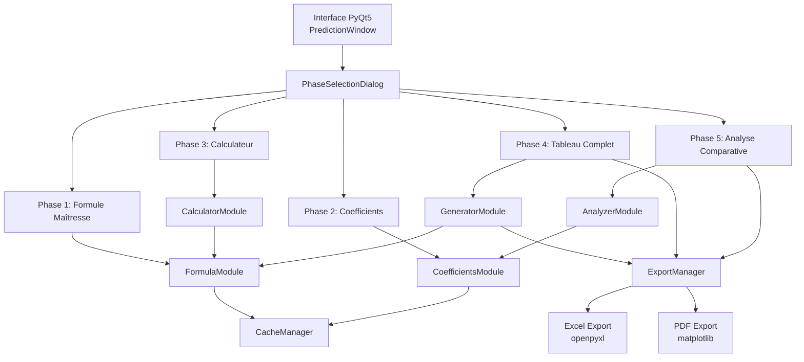
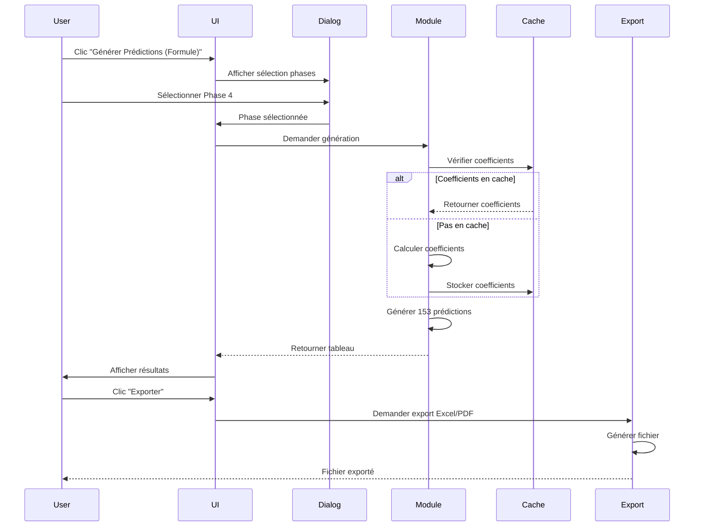

# Document de Conception - Formule de Prédiction à 5 Phases pour la Saison des Pluies

## Vue d'ensemble

Ce document définit l'architecture et la conception technique pour l'implémentation d'une formule de prédiction à 5 phases pour la saison des pluies de la Rivière Tadang. Le système utilise un polynôme d'ordre 6 avec des coefficients annuels et mensuels pour générer des prédictions de débits journaliers sur 153 jours (1er juillet au 30 novembre).

### Objectifs

- Fournir des prédictions précises des débits pour la saison des pluies
- Intégrer 5 phases distinctes dans l'interface utilisateur existante (phase2_prediction.py)
- Optimiser les performances pour des calculs rapides (<500ms pour 153 jours)
- Permettre l'export des résultats en Excel et PDF
- Maintenir la compatibilité avec l'architecture PyQt5 existante

### Portée

Le système couvre:
- Calcul de la formule maîtresse Q(t,A) avec polynôme d'ordre 6
- Affichage des coefficients annuels, mensuels et polynomiaux
- Calculateur de débit pour un jour unique
- Génération de tableau complet de 153 jours
- Analyse comparative annuelle et mensuelle
- Intégration dans l'UI PyQt5 existante
- Export Excel et PDF des résultats

## Architecture

### Architecture Globale

Le système suit une architecture modulaire en 5 phases distinctes, intégrées dans l'application PyQt5 existante:



### Modules Principaux

#### 1. FormulaModule
Responsable du calcul de la formule maîtresse et du polynôme P(t).

**Responsabilités:**
- Calcul du polynôme P(t) d'ordre 6
- Application de la formule Q(t,A) = P(t) × k(A) × Cm × [1 ± ε]
- Calcul des bornes Q_inf et Q_sup
- Validation des paramètres d'entrée

#### 2. CoefficientsModule
Gère les coefficients annuels et mensuels.

**Responsabilités:**
- Calcul de k(A) pour chaque année (2011-2024)
- Stockage des coefficients mensuels (Cm)
- Génération des tableaux A, B, C
- Calcul des statistiques (humidité relative, rangs, statuts)

#### 3. CalculatorModule
Calculateur pour un jour unique.

**Responsabilités:**
- Calcul rapide pour un jour spécifique (t)
- Déduction automatique du mois et Cm
- Validation des entrées utilisateur
- Affichage des résultats formatés

#### 4. GeneratorModule
Génère le tableau complet de 153 jours.

**Responsabilités:**
- Génération vectorisée de 153 prédictions
- Calcul des dates (1er juillet → 30 novembre)
- Attribution des statuts de débit
- Préparation des données pour export

#### 5. AnalyzerModule
Analyse comparative annuelle et mensuelle.

**Responsabilités:**
- Classement annuel par k(A)
- Classement mensuel par Q moyen
- Calcul des qualifications (Très humide, Humide, Normal, Sec, Très sec)
- Calcul du coefficient de variation (CV)

### Flux de Données



## Composants et Interfaces

### 1. FormulaModule

```python
class FormulaModule:
    """Module de calcul de la formule maîtresse"""
    
    # Coefficients du polynôme P(t) d'ordre 6
    POLY_COEFFS = {
        't6': 5.414e-9,
        't5': -2.166e-6,
        't4': 3.115e-4,
        't3': -2.019e-2,
        't2': 5.687e-1,
        't1': 2.741,
        't0': 382.2
    }
    
    # Coefficients mensuels Cm
    MONTHLY_COEFFS = {
        7: 0.697,   # Juillet
        8: 1.011,   # Août
        9: 1.300,   # Septembre
        10: 1.333,  # Octobre
        11: 0.658   # Novembre
    }
    
    # Débit historique de référence
    Q_HISTORICAL = 739.0  # m³/s
    
    def calculate_P(self, t: int) -> float:
        """
        Calcule P(t) avec le polynôme d'ordre 6
        
        Args:
            t: Jour de saison (1-153)
            
        Returns:
            P(t) avec 2 décimales
        """
        pass
    
    def calculate_Q(self, t: int, k_A: float, epsilon: float) -> dict:
        """
        Calcule Q(t,A) avec la formule maîtresse
        
        Args:
            t: Jour de saison (1-153)
            k_A: Coefficient annuel
            epsilon: Taux d'erreur (0.01-0.08)
            
        Returns:
            {
                'P_t': float,
                'Q_central': float,
                'Q_inf': float,
                'Q_sup': float,
                'month': int,
                'Cm': float
            }
        """
        pass
    
    def deduce_month(self, t: int) -> int:
        """
        Déduit le mois à partir du jour de saison
        
        Args:
            t: Jour de saison (1-153)
            
        Returns:
            Mois (7-11)
        """
        pass
    
    def validate_inputs(self, t: int, k_A: float, epsilon: float) -> tuple:
        """
        Valide les paramètres d'entrée
        
        Returns:
            (is_valid: bool, error_message: str)
        """
        pass
```

### 2. CoefficientsModule

```python
class CoefficientsModule:
    """Module de gestion des coefficients"""
    
    def __init__(self, historical_data: pd.DataFrame):
        """
        Initialise avec les données historiques (2011-2024)
        
        Args:
            historical_data: DataFrame avec colonnes 'saison_annee' et 'debits'
        """
        self.data = historical_data
        self.annual_coeffs = {}
        self.monthly_stats = {}
    
    def calculate_annual_coefficients(self) -> pd.DataFrame:
        """
        Calcule k(A) pour chaque année
        
        Returns:
            DataFrame avec colonnes:
            - Année
            - k(A)
            - Humidité relative
            - Q moy
            - Rang humidité
            - Statut
        """
        pass
    
    def calculate_monthly_statistics(self) -> pd.DataFrame:
        """
        Calcule les statistiques mensuelles
        
        Returns:
            DataFrame avec colonnes:
            - Mois
            - Cm
            - Q moy
            - Intervalle P10-P90
            - Tendance %/j
            - Succession max ↑/↓
        """
        pass
    
    def get_polynomial_table(self) -> pd.DataFrame:
        """
        Génère le tableau des coefficients du polynôme
        
        Returns:
            DataFrame avec colonnes:
            - Terme
            - Coefficient
            - Exposant de t
            - Contribution
        """
        pass
    
    def get_k_A(self, year: int) -> float:
        """Retourne k(A) pour une année donnée"""
        pass
```

### 3. CalculatorModule

```python
class CalculatorModule:
    """Module de calcul pour un jour unique"""
    
    def __init__(self, formula_module: FormulaModule):
        self.formula = formula_module
    
    def calculate_single_day(self, t: int, k_A: float, epsilon: float) -> dict:
        """
        Calcule les débits pour un jour spécifique
        
        Args:
            t: Jour de saison (1-153)
            k_A: Coefficient annuel
            epsilon: Taux d'erreur (%)
            
        Returns:
            {
                't': int,
                'date': datetime,
                'month': str,
                'P_t': float,
                'Q_central': float,
                'Q_min': float,
                'Q_max': float,
                'Cm': float
            }
        """
        pass
    
    def format_results(self, results: dict) -> str:
        """Formate les résultats pour affichage"""
        pass
```

### 4. GeneratorModule

```python
class GeneratorModule:
    """Module de génération du tableau complet"""
    
    def __init__(self, formula_module: FormulaModule):
        self.formula = formula_module
        self.cache = {}
    
    def generate_full_table(self, k_A: float, epsilon: float, year: int = None) -> pd.DataFrame:
        """
        Génère le tableau complet de 153 jours
        
        Args:
            k_A: Coefficient annuel
            epsilon: Taux d'erreur (%)
            year: Année de prédiction (optionnel)
            
        Returns:
            DataFrame avec colonnes:
            - t
            - Date
            - Mois
            - P(t)
            - Q centrale
            - Q min (-8%)
            - Q max (+8%)
            - Q réelle (vide)
            - Écart % (vide)
            - Statut
        """
        pass
    
    def assign_status(self, Q_central: float) -> str:
        """
        Assigne le statut basé sur Q centrale
        
        Règles:
        - 🚨 Dangereux: >1200
        - 🔔 Élevé: 900-1200
        - ✅ Normal: 600-900
        - 🌤️ Modéré: 400-600
        - ℹ️ Bas: <400
        """
        pass
    
    def calculate_dates(self, year: int) -> list:
        """Calcule les dates du 1er juillet au 30 novembre"""
        pass
```

### 5. AnalyzerModule

```python
class AnalyzerModule:
    """Module d'analyse comparative"""
    
    def __init__(self, coefficients_module: CoefficientsModule):
        self.coeffs = coefficients_module
    
    def generate_annual_ranking(self) -> pd.DataFrame:
        """
        Génère le classement annuel
        
        Returns:
            DataFrame avec colonnes:
            - Rang
            - Année
            - k(A)
            - Q moy
            - Qualif.
            - vs Moyenne
        """
        pass
    
    def generate_monthly_ranking(self) -> pd.DataFrame:
        """
        Génère le classement mensuel
        
        Returns:
            DataFrame avec colonnes:
            - Rang
            - Mois
            - Q moy
            - Cm
            - Tendance %/j
            - Variabilité CV
            - Statut
        """
        pass
    
    def assign_qualification(self, k_A: float) -> str:
        """
        Assigne la qualification basée sur k(A)
        
        Règles:
        - Très humide: k(A) > 1.2
        - Humide: 1.1 < k(A) ≤ 1.2
        - Normal: 0.9 ≤ k(A) ≤ 1.1
        - Sec: 0.8 ≤ k(A) < 0.9
        - Très sec: k(A) < 0.8
        """
        pass
    
    def calculate_cv(self, data: pd.Series) -> float:
        """Calcule le coefficient de variation"""
        pass
```

### 6. CacheManager

```python
class CacheManager:
    """Gestionnaire de cache pour optimiser les performances"""
    
    def __init__(self):
        self.cache = {}
        self.timestamps = {}
    
    def get(self, key: str) -> any:
        """Récupère une valeur du cache"""
        pass
    
    def set(self, key: str, value: any, ttl: int = 3600):
        """Stocke une valeur dans le cache avec TTL"""
        pass
    
    def invalidate(self, key: str):
        """Invalide une entrée du cache"""
        pass
    
    def clear(self):
        """Vide tout le cache"""
        pass
```

### 7. ExportManager

```python
class ExportManager:
    """Gestionnaire d'export Excel et PDF"""
    
    def export_to_excel(self, data: pd.DataFrame, filename: str, metadata: dict):
        """
        Exporte les données en Excel
        
        Args:
            data: DataFrame à exporter
            filename: Nom du fichier
            metadata: Métadonnées (k(A), ε, date génération)
        """
        pass
    
    def export_to_pdf(self, data: pd.DataFrame, filename: str, metadata: dict):
        """
        Exporte les données en PDF avec graphique
        
        Args:
            data: DataFrame à exporter
            filename: Nom du fichier
            metadata: Métadonnées (k(A), ε, date génération)
        """
        pass
    
    def create_prediction_chart(self, data: pd.DataFrame) -> str:
        """Crée un graphique des prédictions avec matplotlib"""
        pass
```

### 8. PhaseSelectionDialog (UI)

```python
class PhaseSelectionDialog(QDialog):
    """Dialogue de sélection des 5 phases"""
    
    def __init__(self, parent=None):
        super().__init__(parent)
        self.selected_phase = None
        self.init_ui()
    
    def init_ui(self):
        """
        Initialise l'interface avec 5 boutons:
        - Phase 1: Formule Maîtresse
        - Phase 2: Coefficients
        - Phase 3: Calculateur
        - Phase 4: Tableau Complet
        - Phase 5: Analyse Comparative
        """
        pass
    
    def get_selected_phase(self) -> int:
        """Retourne la phase sélectionnée (1-5)"""
        pass
```

## Modèles de Données

### Structure des Coefficients Annuels

```python
@dataclass
class AnnualCoefficient:
    """Coefficient annuel k(A)"""
    year: int
    k_A: float
    humidity_relative: float
    Q_mean: float
    humidity_rank: int
    status: str  # "Très humide", "Humide", "Normal", "Sec", "Très sec"
```

### Structure des Coefficients Mensuels

```python
@dataclass
class MonthlyCoefficient:
    """Coefficient mensuel Cm"""
    month: int
    month_name: str
    Cm: float
    Q_mean: float
    P10_P90_interval: tuple
    trend_percent_per_day: float
    max_succession_up_down: tuple
```

### Structure de Prédiction Journalière

```python
@dataclass
class DailyPrediction:
    """Prédiction pour un jour"""
    t: int  # Jour de saison (1-153)
    date: datetime
    month: str
    P_t: float
    Q_central: float
    Q_min: float
    Q_max: float
    Q_real: Optional[float] = None
    deviation_percent: Optional[float] = None
    status: str = ""  # 🚨, 🔔, ✅, 🌤️, ℹ️
```

### Structure de Métadonnées

```python
@dataclass
class PredictionMetadata:
    """Métadonnées de prédiction"""
    k_A: float
    epsilon: float
    generation_date: datetime
    year: int
    num_days: int = 153
    Q_historical: float = 739.0
    R2: float = 0.988
```

## Gestion des Erreurs

### Hiérarchie des Exceptions

```python
class FormulaError(Exception):
    """Exception de base pour les erreurs de formule"""
    pass

class InvalidDayError(FormulaError):
    """Jour de saison invalide (hors 1-153)"""
    pass

class InvalidCoefficientError(FormulaError):
    """Coefficient annuel invalide (k(A) ≤ 0)"""
    pass

class InvalidEpsilonError(FormulaError):
    """Taux d'erreur invalide (hors 0.01-0.08)"""
    pass

class MissingDataError(FormulaError):
    """Données historiques manquantes"""
    pass

class ExportError(Exception):
    """Erreur lors de l'export"""
    pass
```

### Stratégie de Gestion des Erreurs

1. **Validation des Entrées**
   - Valider tous les paramètres avant calcul
   - Afficher messages d'erreur clairs dans l'UI
   - Logger les erreurs dans un fichier

2. **Gestion des Données Manquantes**
   - Vérifier la présence des données historiques
   - Afficher avertissements pour années incomplètes
   - Permettre continuation avec données partielles

3. **Erreurs de Calcul**
   - Capturer les erreurs numériques (division par zéro, overflow)
   - Afficher message d'erreur et permettre correction
   - Ne pas crasher l'application

4. **Erreurs d'Export**
   - Vérifier permissions d'écriture
   - Gérer les erreurs de bibliothèques (openpyxl, matplotlib)
   - Afficher message explicite avec chemin du fichier

## Stratégie de Test

### Tests Unitaires

**FormulaModule:**
- Test du calcul de P(t) pour valeurs connues
- Test de la formule Q(t,A) avec paramètres variés
- Test de déduction du mois
- Test de validation des entrées

**CoefficientsModule:**
- Test du calcul de k(A) pour années connues
- Test des statistiques mensuelles
- Test du tableau polynomial

**CalculatorModule:**
- Test du calcul pour jour unique
- Test du formatage des résultats

**GeneratorModule:**
- Test de génération du tableau complet
- Test d'attribution des statuts
- Test du calcul des dates

**AnalyzerModule:**
- Test du classement annuel
- Test du classement mensuel
- Test des qualifications
- Test du coefficient de variation

### Tests d'Intégration

- Test du flux complet Phase 1 → Phase 4
- Test de l'intégration UI → Modules
- Test de l'export Excel et PDF
- Test du cache et performances

### Tests de Performance

- Mesurer temps de calcul P(t) (<10ms)
- Mesurer temps de génération 153 jours (<500ms)
- Mesurer temps d'affichage tableaux (<2s)
- Mesurer temps d'export Excel (<3s)
- Mesurer temps d'export PDF (<5s)

### Tests d'Acceptation

Basés sur les 100 critères d'acceptation du document requirements.md:
- Vérifier chaque critère individuellement
- Tester avec données réelles (2011-2024)
- Valider l'intégration dans l'UI existante
- Vérifier les exports générés

## Considérations de Performance

### Optimisations

1. **Calculs Vectorisés**
   - Utiliser NumPy pour calculs sur 153 jours
   - Éviter les boucles Python quand possible
   - Pré-calculer les coefficients constants

2. **Cache**
   - Mettre en cache les coefficients calculés
   - Invalider le cache uniquement si données changent
   - Utiliser TTL pour éviter cache obsolète

3. **Chargement Paresseux**
   - Charger les modules uniquement quand nécessaire
   - Ne pas calculer les tableaux avant demande utilisateur
   - Différer les calculs lourds

4. **Optimisation UI**
   - Utiliser QThread pour calculs longs
   - Afficher barre de progression pour exports
   - Ne pas bloquer l'interface pendant calculs

### Métriques de Performance

| Opération | Objectif | Mesure |
|-----------|----------|--------|
| Calcul P(t) | <10ms | Temps CPU |
| Génération 153 jours | <500ms | Temps total |
| Affichage tableaux | <2s | Temps rendu |
| Export Excel | <3s | Temps écriture |
| Export PDF | <5s | Temps génération |

## Sécurité et Validation

### Validation des Entrées

1. **Jour de saison (t)**
   - Vérifier 1 ≤ t ≤ 153
   - Message: "Erreur: Jour de saison doit être entre 1 et 153"

2. **Coefficient annuel (k(A))**
   - Vérifier k(A) > 0
   - Message: "Erreur: Coefficient annuel doit être strictement positif"

3. **Taux d'erreur (ε)**
   - Vérifier 0.01 ≤ ε ≤ 0.08
   - Message: "Erreur: Taux d'erreur doit être entre 1% et 8%"

### Sécurité des Données

- Ne pas modifier les données historiques
- Valider les données avant calculs
- Logger toutes les opérations critiques
- Sauvegarder les exports dans dossier dédié

## Déploiement et Maintenance

### Intégration dans phase2_prediction.py

1. **Ajout du bouton**
   - Ajouter bouton "🔮 Générer Prédictions (Formule)" dans control_panel
   - Connecter au signal clicked → generate_predictions_formula()

2. **Création du dialogue**
   - Implémenter PhaseSelectionDialog
   - Afficher au clic sur le bouton

3. **Implémentation des phases**
   - Créer méthodes pour chaque phase dans PredictionWindow
   - Intégrer les modules de calcul

4. **Tests d'intégration**
   - Vérifier compatibilité avec fonctionnalités existantes
   - Tester navigation entre phases
   - Valider exports

### Maintenance

- Documenter toutes les fonctions
- Ajouter docstrings avec exemples
- Maintenir tests à jour
- Logger les erreurs pour debugging

## Correctness Properties

*A property is a characteristic or behavior that should hold true across all valid executions of a system—essentially, a formal statement about what the system should do. Properties serve as the bridge between human-readable specifications and machine-verifiable correctness guarantees.*

### Property Reflection

After analyzing all 100 acceptance criteria, I identified the following testable properties. Many criteria are redundant or can be combined:

**Redundancies Identified:**
- Criteria 1.8, 3.2, 4.4 all test month deduction from t → Combined into Property 2
- Criteria 1.10, 3.10 both test idempotence → Combined into Property 1
- Criteria 3.5, 7.1 both test t validation → Combined into Property 8
- Criteria 3.6, 7.2 both test k(A) validation → Combined into Property 9
- Criteria 3.7, 7.3 both test ε validation → Combined into Property 10
- Criteria 5.4-5.8 all test qualification assignment → Combined into Property 15

**Properties Eliminated:**
- UI-specific tests (Exigence 6, 10) → Not suitable for property-based testing
- Performance tests (Exigence 8) → Integration tests, not properties
- Export tests (Exigence 9) → Integration tests, not properties
- Example-based tests (table structure) → Unit tests, not properties

### Property 1: Calculation Idempotence

*For any* valid combination of (t, k(A), ε), calculating Q(t,A) twice consecutively SHALL produce identical results.

**Validates: Requirements 1.10, 3.10**

### Property 2: Month Deduction Correctness

*For any* day of season t ∈ [1, 153], the system SHALL deduce the correct month: t ∈ [1,31] → July, t ∈ [32,62] → August, t ∈ [63,92] → September, t ∈ [93,123] → October, t ∈ [124,153] → November.

**Validates: Requirements 1.8, 3.2, 4.4**

### Property 3: Monthly Coefficient Application

*For any* day of season t, the system SHALL apply the monthly coefficient Cm corresponding to the deduced month.

**Validates: Requirements 1.9, 3.3**

### Property 4: Polynomial Calculation Accuracy

*For any* valid t ∈ [1, 153], P(t) SHALL equal 5.414×10⁻⁹·t⁶ − 2.166×10⁻⁶·t⁵ + 3.115×10⁻⁴·t⁴ − 2.019×10⁻²·t³ + 5.687×10⁻¹·t² + 2.741·t + 382.2 (within floating-point precision).

**Validates: Requirements 1.1**

### Property 5: Master Formula Correctness

*For any* valid (t, k(A), ε), Q(t,A) SHALL equal P(t) × k(A) × Cm(month) × [1 ± ε].

**Validates: Requirements 1.3**

### Property 6: Lower Bound Calculation

*For any* valid (t, k(A)), Q_inf SHALL equal P(t) × k(A) × Cm × 0.92.

**Validates: Requirements 1.4**

### Property 7: Upper Bound Calculation

*For any* valid (t, k(A)), Q_sup SHALL equal P(t) × k(A) × Cm × 1.08.

**Validates: Requirements 1.5**

### Property 8: Day Validation

*For any* t < 1 or t > 153, the system SHALL reject the input with error message "Jour invalide: doit être entre 1 et 153".

**Validates: Requirements 1.6, 3.5, 7.1**

### Property 9: Annual Coefficient Validation

*For any* k(A) ≤ 0, the system SHALL reject the input with error message "Coefficient annuel invalide: doit être > 0".

**Validates: Requirements 1.6, 3.6, 7.2**

### Property 10: Epsilon Validation

*For any* ε < 0.01 or ε > 0.08, the system SHALL reject the input with error message "Taux d'erreur invalide: doit être entre 1% et 8%".

**Validates: Requirements 1.7, 3.7, 7.3**

### Property 11: Precision Formatting

*For any* calculated P(t), the formatted output SHALL have exactly 2 decimal places.

**Validates: Requirements 1.2, 3.9**

### Property 12: Annual Coefficient Calculation

*For any* year with average flow Q̄_année, k(A) SHALL equal Q̄_année / 739.

**Validates: Requirements 2.4**

### Property 13: Coefficient Formatting

*For any* coefficient displayed in tables, the formatted output SHALL have at least 3 decimal places.

**Validates: Requirements 2.7**

### Property 14: Table Completeness

*For any* historical data with N years (2011-2024), Tableau A SHALL contain exactly N rows without omission.

**Validates: Requirements 2.10**

### Property 15: Qualification Assignment

*For any* k(A), the system SHALL assign the correct qualification: "Très humide" if k(A) > 1.2, "Humide" if 1.1 < k(A) ≤ 1.2, "Normal" if 0.9 ≤ k(A) ≤ 1.1, "Sec" if 0.8 ≤ k(A) < 0.9, "Très sec" if k(A) < 0.8.

**Validates: Requirements 5.4, 5.5, 5.6, 5.7, 5.8**

### Property 16: Table Row Count

*For any* valid (k(A), ε), the generated prediction table SHALL contain exactly 153 rows.

**Validates: Requirements 4.1**

### Property 17: Date Calculation Correctness

*For any* t ∈ [1, 153], the calculated date SHALL be correct: t=1 → July 1, t=153 → November 30, with all intermediate dates correctly mapped.

**Validates: Requirements 4.3**

### Property 18: Status Assignment

*For any* Q centrale, the system SHALL assign the correct status: 🚨 if Q > 1200, 🔔 if 900 ≤ Q ≤ 1200, ✅ if 600 ≤ Q < 900, 🌤️ if 400 ≤ Q < 600, ℹ️ if Q < 400.

**Validates: Requirements 4.7**

### Property 19: Deviation Calculation

*For any* row with Q réelle provided, Écart % SHALL equal ((Q réelle - Q centrale) / Q centrale) × 100.

**Validates: Requirements 4.6**

### Property 20: Average Flow Invariant

*For any* generated prediction table, the sum of all Q centrale values divided by 153 SHALL approximately equal the Q̄_année used to calculate k(A) (within 5% tolerance).

**Validates: Requirements 4.10**

### Property 21: Comparison vs Average

*For any* k(A), "vs Moyenne" SHALL equal ((k(A) - 1.0) / 1.0) × 100.

**Validates: Requirements 5.9**

### Property 22: Coefficient of Variation

*For any* monthly data, CV SHALL equal (standard deviation / mean) × 100.

**Validates: Requirements 5.10**

### Property 23: Annual Ranking Sort Order

*For any* annual ranking table, rows SHALL be sorted by k(A) in descending order.

**Validates: Requirements 2.8, 5.3**

### Property 24: Monthly Ranking Sort Order

*For any* monthly ranking table, rows SHALL be sorted by Q moy in descending order.

**Validates: Requirements 5.11**

### Property 25: Monthly Ranking Completeness

*For any* monthly ranking for the rainy season, the table SHALL contain exactly 5 rows representing July, August, September, October, and November.

**Validates: Requirements 5.13**

## Testing Strategy

### Overview

The testing strategy employs a dual approach combining property-based testing (PBT) for universal properties and unit testing for specific examples and edge cases. This feature is highly suitable for PBT because it involves pure mathematical calculations with clear input/output behavior and universal properties that should hold across all valid inputs.

### Property-Based Testing

**Library Selection:** We will use `hypothesis` for Python, which is the standard PBT library for Python projects.

**Test Configuration:**
- Minimum 100 iterations per property test
- Each property test references its design document property
- Tag format: `# Feature: rainy-season-prediction-formula, Property {number}: {property_text}`

**Property Test Implementation:**

Each of the 25 correctness properties will be implemented as a property-based test:

1. **Property 1-7 (Formula Calculations):** Generate random valid inputs (t, k(A), ε) and verify mathematical correctness
2. **Property 8-10 (Validation):** Generate both valid and invalid inputs to test boundary conditions
3. **Property 11-13 (Formatting):** Generate random values and verify formatting rules
4. **Property 14-25 (Tables and Rankings):** Generate random historical data and verify table properties

**Example Property Test Structure:**

```python
from hypothesis import given, strategies as st
import pytest

@given(
    t=st.integers(min_value=1, max_value=153),
    k_A=st.floats(min_value=0.1, max_value=2.0),
    epsilon=st.floats(min_value=0.01, max_value=0.08)
)
def test_property_1_calculation_idempotence(t, k_A, epsilon):
    """
    Feature: rainy-season-prediction-formula, Property 1: 
    For any valid (t, k(A), ε), calculating Q(t,A) twice SHALL produce identical results
    """
    formula = FormulaModule()
    
    # Calculate twice
    result1 = formula.calculate_Q(t, k_A, epsilon)
    result2 = formula.calculate_Q(t, k_A, epsilon)
    
    # Verify idempotence
    assert result1['Q_central'] == result2['Q_central']
    assert result1['Q_inf'] == result2['Q_inf']
    assert result1['Q_sup'] == result2['Q_sup']
    assert result1['P_t'] == result2['P_t']
```

### Unit Testing

**Purpose:** Unit tests complement property tests by:
- Testing specific examples with known expected outputs
- Verifying table structure and column names
- Testing edge cases explicitly
- Validating constant values (R²=0.988, monthly coefficients)

**Unit Test Coverage:**

1. **Table Structure Tests:**
   - Verify Tableau A has correct columns (Req 2.1)
   - Verify Tableau B has correct columns (Req 2.2)
   - Verify Tableau C has correct columns (Req 2.3)
   - Verify R²=0.988 in Tableau C (Req 2.5)
   - Verify monthly coefficients are correct (Req 2.9)

2. **Edge Case Tests:**
   - Test t=1 (first day, July 1)
   - Test t=153 (last day, November 30)
   - Test boundary values for k(A) (0.001, 0.8, 1.2, 2.0)
   - Test boundary values for ε (0.01, 0.08)
   - Test month boundaries (t=31/32, t=62/63, etc.)

3. **Error Message Tests:**
   - Test exact error messages for invalid inputs
   - Test warning messages for missing data

4. **Constant Value Tests:**
   - Verify polynomial coefficients are correct
   - Verify monthly coefficients (Cm) are correct
   - Verify Q_historical = 739.0

### Integration Testing

**Purpose:** Integration tests verify:
- UI integration with calculation modules
- Export functionality (Excel, PDF)
- Performance requirements
- End-to-end workflows

**Integration Test Scenarios:**

1. **Phase 1-5 Workflow:**
   - User selects Phase 1 → enters k(A) and ε → calculates Q
   - User selects Phase 2 → displays all three tables
   - User selects Phase 3 → calculates single day
   - User selects Phase 4 → generates 153-day table → exports Excel/PDF
   - User selects Phase 5 → displays rankings

2. **Export Tests:**
   - Export 153-day table to Excel → verify file exists and is readable
   - Export 153-day table to PDF → verify file exists and contains chart
   - Export coefficients to Excel → verify all tables included
   - Verify exported files can be opened without errors (Req 9.10)

3. **Performance Tests:**
   - Measure P(t) calculation time < 10ms (Req 8.1)
   - Measure 153-day generation time < 500ms (Req 8.2)
   - Measure table display time < 2s (Req 8.3)
   - Measure Excel export time < 3s (Req 8.5)
   - Measure PDF export time < 5s (Req 8.6)

4. **UI Integration Tests:**
   - Test phase selection dialog
   - Test navigation between phases
   - Test data persistence across phases
   - Test error dialogs display correctly

### Test Organization

```
tests/
├── unit/
│   ├── test_formula_module.py
│   ├── test_coefficients_module.py
│   ├── test_calculator_module.py
│   ├── test_generator_module.py
│   ├── test_analyzer_module.py
│   ├── test_cache_manager.py
│   └── test_export_manager.py
├── property/
│   ├── test_properties_formula.py      # Properties 1-7
│   ├── test_properties_validation.py   # Properties 8-10
│   ├── test_properties_formatting.py   # Properties 11-13
│   ├── test_properties_tables.py       # Properties 14-25
│   └── conftest.py                     # Hypothesis configuration
├── integration/
│   ├── test_ui_integration.py
│   ├── test_export_integration.py
│   ├── test_performance.py
│   └── test_end_to_end.py
└── fixtures/
    ├── historical_data_2011_2024.xlsx
    └── expected_outputs.json
```

### Test Data

**Historical Data Fixture:**
- Real data from 2011-2024 for integration tests
- Synthetic data generators for property tests
- Known expected outputs for validation

**Hypothesis Strategies:**

```python
# Custom strategies for domain-specific values
@st.composite
def valid_day_of_season(draw):
    """Generate valid day of season (1-153)"""
    return draw(st.integers(min_value=1, max_value=153))

@st.composite
def valid_k_A(draw):
    """Generate valid annual coefficient (>0)"""
    return draw(st.floats(min_value=0.001, max_value=3.0))

@st.composite
def valid_epsilon(draw):
    """Generate valid error rate (0.01-0.08)"""
    return draw(st.floats(min_value=0.01, max_value=0.08))

@st.composite
def invalid_day_of_season(draw):
    """Generate invalid day of season"""
    return draw(st.one_of(
        st.integers(max_value=0),
        st.integers(min_value=154)
    ))
```

### Coverage Goals

- **Property Tests:** 100% coverage of 25 correctness properties
- **Unit Tests:** 90% code coverage of all modules
- **Integration Tests:** 100% coverage of user workflows
- **Performance Tests:** All 5 performance requirements validated

### Continuous Testing

- Run property tests on every commit (100 iterations)
- Run full test suite (1000 iterations) nightly
- Run performance tests weekly
- Run integration tests before each release

## Annexes

### Formule Complète

```
Q(t,A) = P(t) × k(A) × Cm(mois) × [1 ± ε(t)]

où:
P(t) = 5.414×10⁻⁹·t⁶ − 2.166×10⁻⁶·t⁵ + 3.115×10⁻⁴·t⁴ − 2.019×10⁻²·t³ + 5.687×10⁻¹·t² + 2.741·t + 382.2

k(A) = Q̄_année / Q̄_historique (739 m³/s)

Cm = {
    Juillet: 0.697,
    Août: 1.011,
    Septembre: 1.300,
    Octobre: 1.333,
    Novembre: 0.658
}

Q_inf = P(t) × k(A) × Cm × 0.92
Q_sup = P(t) × k(A) × Cm × 1.08
```

### Mapping Jour → Mois

| Jour (t) | Mois | Jours dans le mois |
|----------|------|-------------------|
| 1-31 | Juillet | 31 |
| 32-62 | Août | 31 |
| 63-92 | Septembre | 30 |
| 93-123 | Octobre | 31 |
| 124-153 | Novembre | 30 |

### Statuts de Débit

| Statut | Icône | Plage Q (m³/s) |
|--------|-------|----------------|
| Dangereux | 🚨 | >1200 |
| Élevé | 🔔 | 900-1200 |
| Normal | ✅ | 600-900 |
| Modéré | 🌤️ | 400-600 |
| Bas | ℹ️ | <400 |

### Qualifications Annuelles

| Qualification | Plage k(A) |
|---------------|------------|
| Très humide | >1.2 |
| Humide | 1.1-1.2 |
| Normal | 0.9-1.1 |
| Sec | 0.8-0.9 |
| Très sec | <0.8 |
